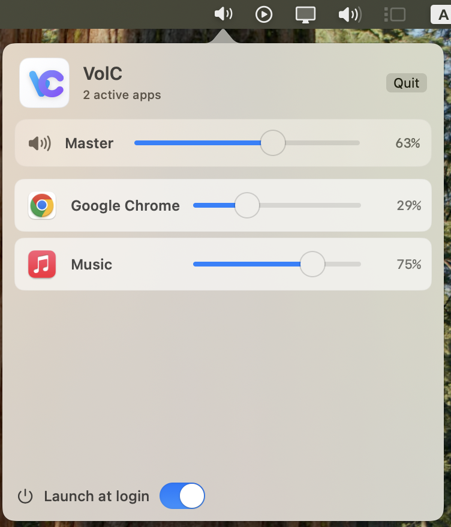
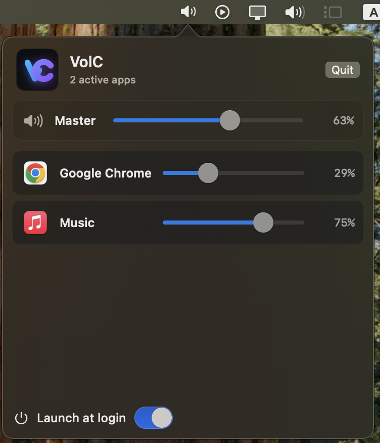

# VolC

<p align="left">
  
</p>

[](https://github.com/Bakar404/VolC/actions/workflows/macos-ci.yml)

VolC is a small native macOS menu bar app for controlling app audio where macOS exposes a safe public path to do it.

The app is intentionally simple: no virtual audio devices, no kernel extensions, no third-party dependencies, and no microphone capture.

## Screenshots

| Light                                                                                          | Dark                                                                                         |
| ---------------------------------------------------------------------------------------------- | -------------------------------------------------------------------------------------------- |
|  |  |

## Status

VolC is usable, but it is also honest about macOS limitations. Public CoreAudio HAL can enumerate apps that are producing audio, but it does not provide a public writable per-process gain control. For that reason, VolC uses CoreAudio for discovery and falls back to AppleScript for apps that expose scriptable volume controls.

## Compatibility

- Runtime target: macOS 13 Ventura or newer
- Current maintainer test machine: macOS 15.7.1 Sequoia
- UI: SwiftUI + AppKit menu bar popover
- Audio discovery: CoreAudio HAL
- Launch at login: `SMAppService`

See [docs/COMPATIBILITY.md](docs/COMPATIBILITY.md) for macOS and Xcode guidance. If the Mac App Store says the newest Xcode requires a newer macOS version, use Apple's developer downloads page to install a compatible older Xcode.

## Supported Per-App Controls

| App              | Bundle ID                                        | Support level                                                     |
| ---------------- | ------------------------------------------------ | ----------------------------------------------------------------- |
| Spotify          | `com.spotify.client`                             | Uses Spotify's AppleScript `sound volume` property                |
| Music            | `com.apple.Music`                                | Uses Music's AppleScript `sound volume` property                  |
| Google Chrome    | `com.google.Chrome`, `com.google.Chrome.helper*` | Sets reachable `audio` and `video` element volume in Chrome tabs  |
| Microsoft Edge   | `com.microsoft.edgemac`, helper processes        | Sets reachable `audio` and `video` element volume in Edge tabs    |
| Brave            | `com.brave.Browser`, helper processes            | Sets reachable `audio` and `video` element volume in Brave tabs   |
| Vivaldi          | `com.vivaldi.Vivaldi`, helper processes          | Sets reachable `audio` and `video` element volume in Vivaldi tabs |
| Opera / Opera GX | `com.operasoftware.Opera*`, helper processes     | Sets reachable `audio` and `video` element volume in Opera tabs   |
| Safari           | `com.apple.Safari`                               | Sets reachable `audio` and `video` element volume in Safari tabs  |

Browser support requires **Allow JavaScript from Apple Events** in that browser. Browser support does not reach cross-origin frames, native browser UI sounds, DRM media that blocks script access, or browsers without compatible AppleScript automation.

Apps without AppleScript support are shown as read-only because public HAL discovery can see them, but public HAL cannot set their individual output gain.

Known read-only categories include Zoom, Discord, Firefox, most games, and most Electron apps. These apps can usually be detected while producing audio, but VolC cannot change their individual system output volume without using a virtual audio device or private API.

## Build and Run

1. Install a compatible Xcode. See [docs/COMPATIBILITY.md](docs/COMPATIBILITY.md).
2. Clone the repo:

   ```zsh
   git clone https://github.com/Bakar404/VolC.git
   cd VolC
   ```

3. Open the project:

   ```zsh
   open -a Xcode VolC.xcodeproj
   ```

4. In Xcode, select the `VolC` scheme and `My Mac`.
5. If prompted, choose a local signing team under **Signing & Capabilities**.
6. Press `Cmd + R`.

VolC runs as a menu bar app, so it will not appear in the Dock. Look for the speaker icon near the clock/Wi-Fi area.

## Permissions

VolC may ask for Apple Events automation permission when it controls Spotify, Music, or Chrome. If you denied the prompt, enable it later in:

**System Settings > Privacy & Security > Automation**

VolC does not capture audio, create an input stream, use `AVCapture`, or access the microphone. It should not trigger the macOS microphone privacy indicator.

## Troubleshooting

- **Chrome slider moves but audio does not change**
  - Enable **Chrome > View > Developer > Allow JavaScript from Apple Events**.
  - Make sure the page actually contains a normal HTML `audio` or `video` element.
  - Some DRM players, cross-origin frames, and browser UI sounds cannot be controlled this way.

- **An app is read-only**
  - That app is visible through CoreAudio, but VolC has no public way to set its per-app gain.
  - Add app-specific AppleScript support in `AppleScriptVolumeBackend.swift` if the app exposes a scriptable volume API.

- **No menu bar icon**
  - In Xcode, confirm the app is still running.
  - VolC is an accessory app and will not show in the Dock.

- **Xcode App Store page says macOS 26+ is required**
  - Download a compatible older Xcode from Apple's developer downloads page instead of the App Store.

## Project Structure

```text
VolC.xcodeproj/
VolC/
  VolCApp.swift
  AppDelegate.swift
  Models/
  Services/
  ViewModels/
  Views/
  Resources/
  Info.plist
  VolC.entitlements
docs/
.github/
```

## Development

Efficiency notes:

- Active audio apps are polled every 3 seconds.
- Slider changes are debounced before AppleScript is executed, so dragging a slider does not spam browser automation.
- VolC does not allocate audio buffers or process live audio samples.
- No background worker is kept alive for unsupported/read-only apps.

Quick local checks:

```zsh
swiftc -typecheck -target arm64-apple-macos13.0 -sdk "$(xcrun --sdk macosx --show-sdk-path)" $(find VolC -name '*.swift')
plutil -lint VolC.xcodeproj/project.pbxproj VolC/Info.plist VolC/VolC.entitlements
```

For release guidance, see [docs/RELEASE.md](docs/RELEASE.md).

## Contributing and Safety

- Contribution guide: [docs/CONTRIBUTING.md](docs/CONTRIBUTING.md)
- App support policy: [docs/APP_SUPPORT_POLICY.md](docs/APP_SUPPORT_POLICY.md)
- Security policy: [docs/SECURITY.md](docs/SECURITY.md)
- Code of conduct: [docs/CODE_OF_CONDUCT.md](docs/CODE_OF_CONDUCT.md)

## License

MIT. See [LICENSE](LICENSE).
